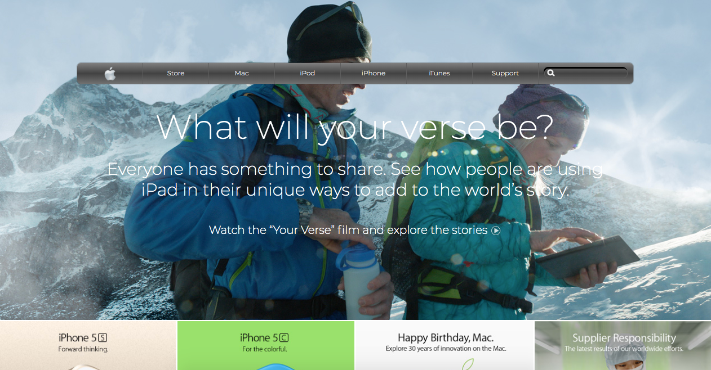

# AppleClone

> This is an old Apple website clone, which I developed on my own using pure HTML and CSS, and I suggested to name it AppleClone. I used the current standard FlexBox to align and position elements.

## Built With

- HTML, CSS, FlexBox

## Live Demo

[Live Demo Link](https://rawcdn.githack.com/xtrmdarc/background-and-gradients/9eab44a246332927144edf49e503e0a916a4fbd1/index.html)

## Getting Started

To get a local copy up and running follow these simple example steps.

### Prerequisites
To make this repository working in your local machine you need only a browser.

## Authors

👤 **Diego Antonio Reyes Coronado**

- Github: [@githubhandle](https://github.com/xtrmdarc)
- Twitter: [@twitterhandle](https://twitter.com/DiegoAn91629127)
- Linkedin: [linkedin](https://www.linkedin.com/in/diego-reyes-coronado-7a7189b7/)

## 🤝 Contributing

Contributions, issues and feature requests are welcome!

Feel free to check the [issues page](https://github.com/xtrmdarc/background-and-gradients/issues).

## Show your support

Give a ⭐️ if you like this project!

## License

This project is [MIT](lic.url) licensed.
